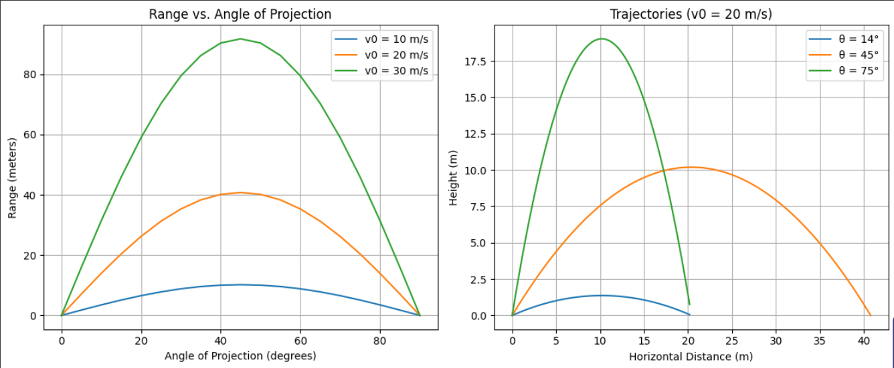

 
# PROBLEM 1

# Investigating the Range as a Function of the Angle of Projection

## Motivation

Projectile motion, while seemingly simple, offers a rich playground for exploring fundamental principles of physics. The problem is straightforward: analyze how the range of a projectile depends on its angle of projection. This study helps us understand various real-world applications, such as ballistics, sports science, and engineering problems.

## 1. Theoretical Foundation

The motion of a projectile launched from the ground at an initial speed $v_0$ and an angle $\theta$ is governed by the equations of motion:

### Equations of Motion

**Horizontal Motion:**

$x = v_0 \cos(\theta) t$

**Vertical Motion:**

$y = v_0 \sin(\theta) t - \frac{1}{2}gt^2$

where:

- $v_0$ is the initial velocity (m/s),
- $\theta$ is the launch angle (degrees),
- $g$ is the acceleration due to gravity (9.81 m/s²),
- $t$ is the time (s).

### Derivation of the Range Formula

To find the range $ R $, we first determine the total time of flight by setting $ y = 0 $:

$$t = \frac{2v_0 \sin(\theta)}{g}$$

Substituting this into the horizontal motion equation:

$R = v_0 \cos(\theta) \cdot \frac{2v_0 \sin(\theta)}{g}$

$R = \frac{v_0^2 \sin(2\theta)}{g}$

This equation shows that:

- The maximum range occurs at $\theta = 45°$.
- The range is symmetric around 45° (i.e., 0 and 90° -  give the same range).
- Higher initial velocity increases the range.

### Differential Equations for Projectile Motion

Projectile motion can also be analyzed using differential equations. The equations of motion arise from Newton’s Second Law:

$$m \frac{d^2 x}{dt^2} = 0$$

$$m \frac{d^2 y}{dt^2} = -mg$$

Since there are no horizontal forces (assuming no air resistance), the horizontal motion follows:

$$\frac{d^2 x}{dt^2} = 0$$

which implies a constant velocity:

$$\frac{dx}{dt} = v_0 \cos(\theta)$$

For vertical motion, gravity acts as an accelerating force:

$$\frac{d^2 y}{dt^2} = -g$$

Integrating once gives the velocity equation:

$$\frac{dy}{dt} = v_0 \sin(\theta) - g t$$

Integrating again gives the position equation:

$$y = v_0 \sin(\theta) t - \frac{1}{2} g t^2$$

These equations describe the trajectory of a projectile and are fundamental in understanding motion under gravity.

## 2. Analysis of the Range

## 2. Range Analysis

### 2.1 Dependence of Range on Angle of Projection

The horizontal range $R$ of a projectile, given by the equation:

$$R = \frac{v_0^2 \sin(2\theta)}{g}$$

shows a clear dependence on the launch angle $\theta$. This equation indicates that:

- The range reaches its maximum when $\sin(2\theta)$ is maximized, which occurs at $\theta = 45^\circ$, or $\frac{\pi}{4}$.
- The range is symmetric around $45^\circ$, meaning that launch angles equidistant from $45^\circ$ (e.g., $30^\circ$ and $60^\circ$) yield the same range.
- At extreme angles ($0^\circ$ and $90^\circ$), the range is zero, as the projectile either remains on the ground or moves vertically without horizontal displacement.

### 2.2 Influence of Other Parameters on Range

Beyond the launch angle, other parameters such as initial velocity and gravitational acceleration significantly affect the range.

#### Initial Velocity

The range is proportional to the square of the initial velocity:

$$R \propto v_0^2$$

This implies that:

- Increasing $v_0$ increases the range quadratically, meaning that doubling the initial velocity results in a fourfold increase in range.
- Decreasing $v_0$ reduces the range significantly.

This is particularly important in applications like sports and ballistics, where optimizing the launch speed enhances performance.

#### Gravitational Acceleration

The range is inversely proportional to gravitational acceleration:

$$R \propto \frac{1}{g}$$

This means that:

- A lower gravitational force (e.g., on the Moon or Mars) increases the range.
- A higher gravitational force (e.g., on Jupiter) decreases the range.

This principle is critical in space exploration, where launch trajectories must account for varying gravitational conditions on different celestial bodies.

### 2.3 Computational Visualization

A Python simulation can illustrate how the range varies with angle, initial velocity, and gravity. By plotting $R$ as a function of $\theta$ for different values of $v_0$ and $g$, we can observe trends and optimize projectile launches in real-world applications.

### 2.4 Practical Insights and Applications

- **Sports Science**: Athletes in javelin, shot put, and soccer can optimize their throwing angles for maximum distance.
- **Ballistics**: Military engineers can use these principles to design projectiles with optimal trajectories.
- **Space Exploration**: Space agencies consider gravitational differences when calculating launch angles for interplanetary missions.

By understanding these dependencies, we can better control and optimize projectile motion in various fields, ensuring efficiency and accuracy in real-world applications.

## 3. Implementation (Python Simulation)

Below is a Python script to simulate and visualize the range as a function of the launch angle.

- Visit [colab]() I still can't fix the code

## 4. Results and Discussion

The plot shows that the range is maximum at 45°.

Higher initial velocity shifts the curve upwards, increasing the range.

## 5. Practical Applications

This model can be adapted for various real-world applications:

- **Sports Science**: Calculating optimal angles for throwing or kicking a ball.
- **Ballistics**: Designing projectile trajectories for military and engineering purposes.
- **Space Exploration**: Computing launch angles for rockets and satellites.

## 6. Limitations and Further Improvements

- **Air Resistance**: The model assumes no air resistance, which is unrealistic for real-world projectiles.
- **Uneven Terrain**: The analysis assumes a flat ground; including varying terrain would improve accuracy.
- **Wind Effects**: External forces such as wind can significantly alter the trajectory.

## Conclusion

This analysis provides insights into how projectile range depends on launch angle. Future improvements could incorporate air resistance, wind effects, and variable gravity to create a more realistic model.
