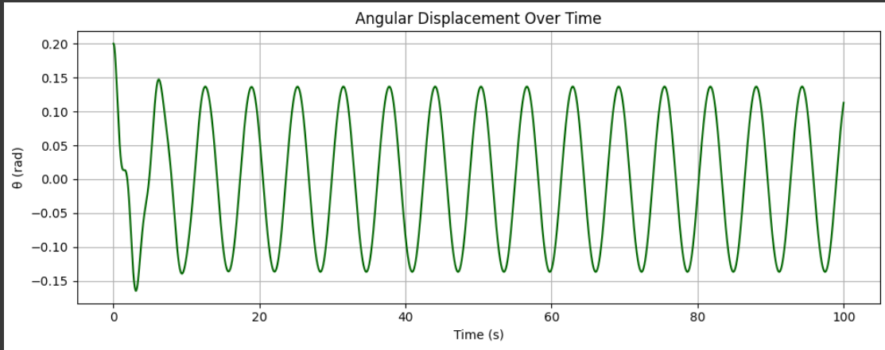
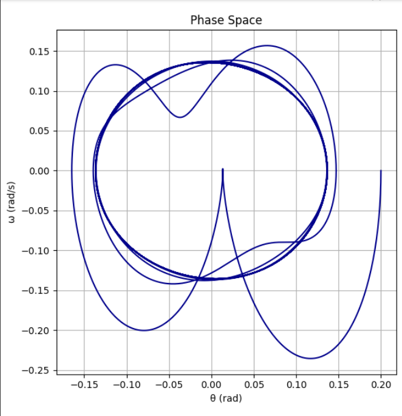

# Problem 2
# Investigating the Dynamics of a Forced Damped Pendulum

## Motivation

The forced damped pendulum serves as a paradigmatic example in the study of nonlinear dynamics. Its rich behavior arises from the interplay of three key factors: restoring forces (gravity), damping (friction or air resistance), and an external periodic driving force. Unlike the simple pendulum, which exhibits predictable periodic motion, the forced damped pendulum can transition into complex behaviors, including resonance, bifurcations, and chaos. These phenomena offer crucial insights into real-world systems such as mechanical oscillators, electrical circuits, climate models, and biological rhythms.

By introducing both damping and external periodic forcing, we open the door to a wide spectrum of behaviors depending on the system's parameters. When the damping is low and the driving force frequency is near the system's natural frequency, resonance occurs, potentially leading to large oscillations. As the driving force increases or damping changes, the system may shift into quasiperiodic or even chaotic motion. Understanding these transitions is not only fundamental to physics but also essential for engineering systems subject to vibrations and periodic stresses.

## 1. Theoretical Foundation

### Governing Equation

The motion of a forced damped pendulum is governed by the nonlinear second-order differential equation:

$\frac{d^{2}\theta}{dt^{2}} + b\frac{d\theta}{dt} + \frac{g}{L}\sin\theta = A\cos(\omega t)$

Where:
- $\theta(t)$: angular displacement
- $b$: damping coefficient
-  g : gravitational acceleration
-  L : pendulum length
-  A : amplitude of the external force
-  $\omega$ : frequency of the external force

### Small-Angle Approximation

For small oscillations, where $\theta \ll 1$, we can approximate $\sin(\theta) \approx \theta$, reducing the equation to:

$\frac{d^{2}\theta}{dt^{2}} + b\frac{d\theta}{dt} + \frac{g}{L}\theta = A\cos(\omega t)$

This is the equation of a driven damped harmonic oscillator, a well-studied system with known solutions.

### Resonance and Energy Considerations

The natural frequency of the system is $\omega_0 = \sqrt{g/L}$. Resonance occurs when the driving frequency $\omega$ is close to $\omega_0$. At resonance, energy input from the external force constructively interferes with the motion, potentially leading to large oscillations if not mitigated by damping.

The energy of the system fluctuates with time, influenced by the driving force and dissipation through damping. Analyzing energy flow helps understand how the system transitions into different dynamical regimes.

## 2. Analysis of Dynamics

The behavior of the system changes dramatically depending on the values of:
- **Damping coefficient** \( b \)
- **Driving amplitude** \( A \)
- **Driving frequency** $\omega$

### Regular vs Chaotic Motion

- **Low Amplitude / High Damping**: Regular, periodic oscillations.
- **Resonant Driving**: Large-amplitude oscillations, sensitive to initial conditions.
- **Intermediate Regimes**: Quasiperiodic behavior.
- **Strong Driving / Low Damping**: Chaotic motion characterized by sensitive dependence on initial conditions and strange attractors.

By examining phase portraits, time series, and Poincaré sections, we can visualize and categorize these different regimes. Bifurcation diagrams reveal how slight changes in parameters can lead to qualitative changes in the system's behavior.

## 3. Practical Applications

The forced damped pendulum is more than a theoretical curiosity. It provides a valuable model for many physical systems:

- **Energy Harvesting Devices**: Pendulums with piezoelectric elements convert mechanical motion into electrical energy.
- **Suspension Bridges and Skyscrapers**: Engineers must understand resonant frequencies to prevent catastrophic oscillations.
- **Oscillating Electrical Circuits**: Driven RLC circuits follow similar equations.
- **Biomechanics**: Human gait and rhythmic activities can be modeled as driven damped oscillators.

## 4. Implementation

### Time Evolution and Phase Diagram

[colab link](https://colab.research.google.com/drive/1GH6SyOx-kLdMq42tUu6mfLW_oVMXbmcl?usp=sharing)

For the bifurcation diagram, vary the driving amplitude or frequency and record long-term behavior.

## 5. Conclusion and Future Work

The forced damped pendulum is a rich system that illustrates the complexity emerging from nonlinear differential equations. By studying its behavior through numerical simulations, we uncover a fascinating spectrum of dynamics, from simple harmonic motion to chaos.

### Limitations
- Assumes 2D motion.
- Damping is modeled linearly.
- External forcing is purely sinusoidal.

### Extensions
- Introduce nonlinear or velocity-dependent damping.
- Use non-sinusoidal or stochastic driving forces.
- Expand to double or coupled pendulums.

This study not only deepens our understanding of fundamental physics but also equips us with tools to address real-world challenges across engineering and science disciplines.

[colab simulation](https://colab.research.google.com/drive/1H4RI7o1dWtaqi0m2dv8FE1p8UMqy_ItR?usp=sharing)
---

