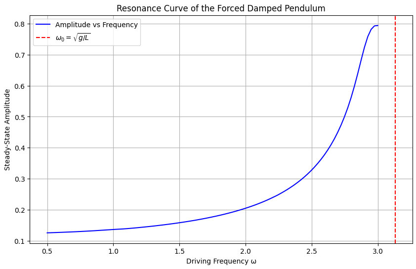
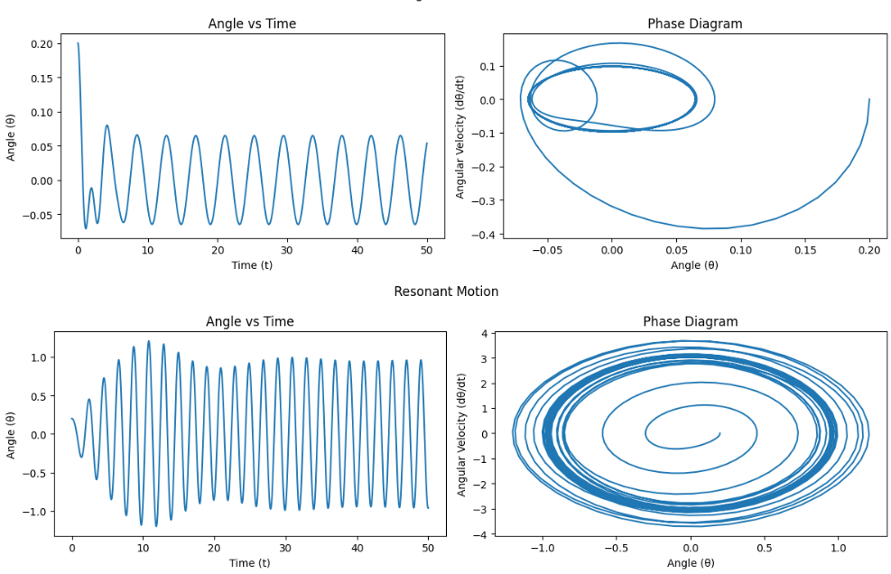
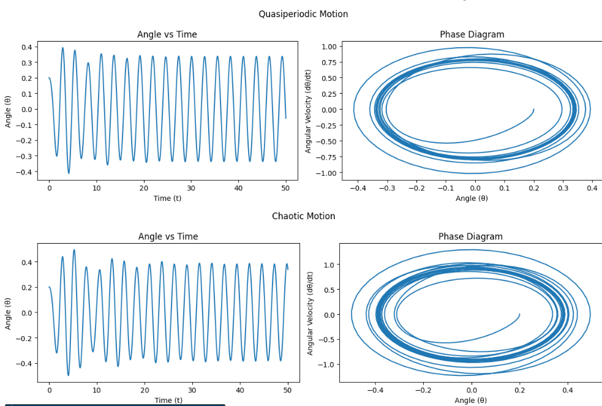
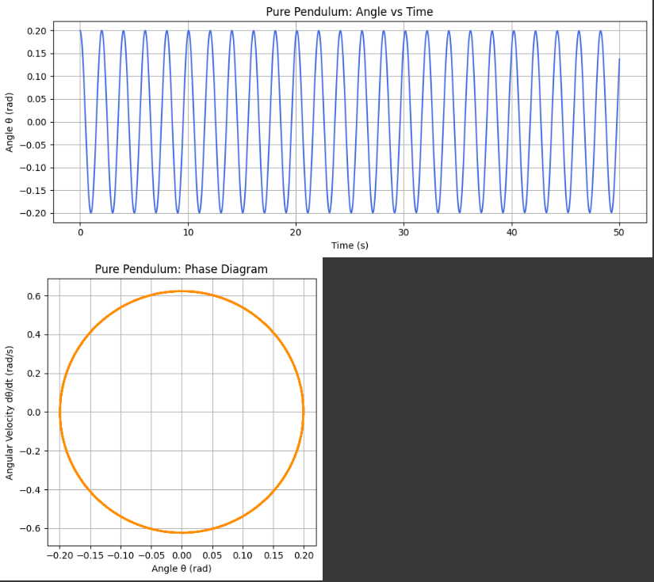
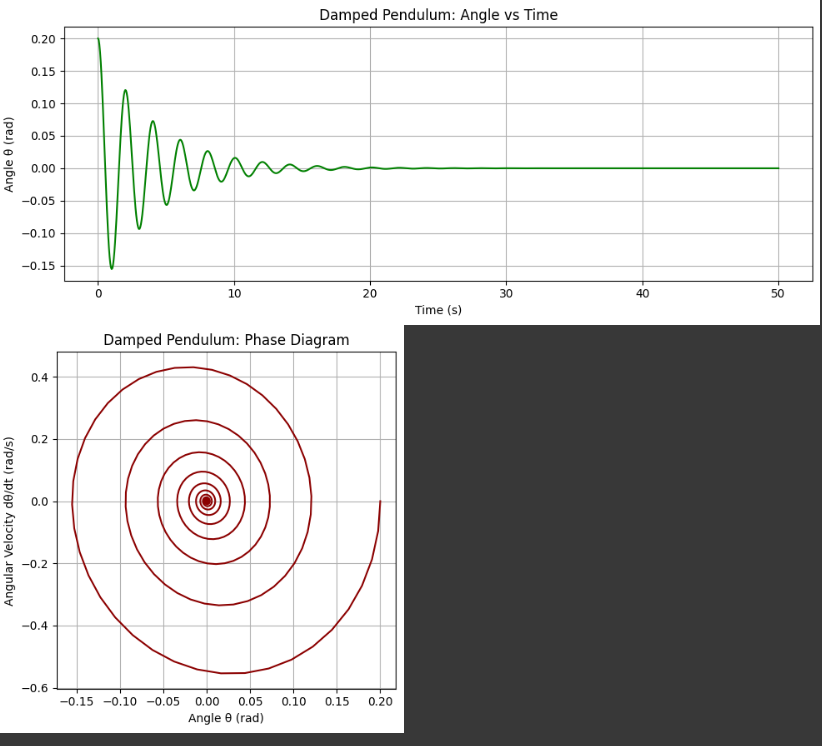
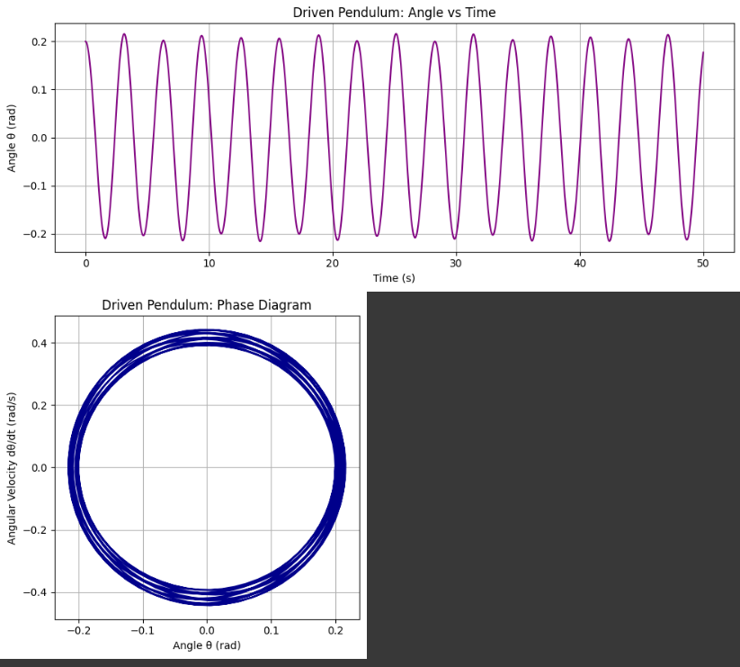
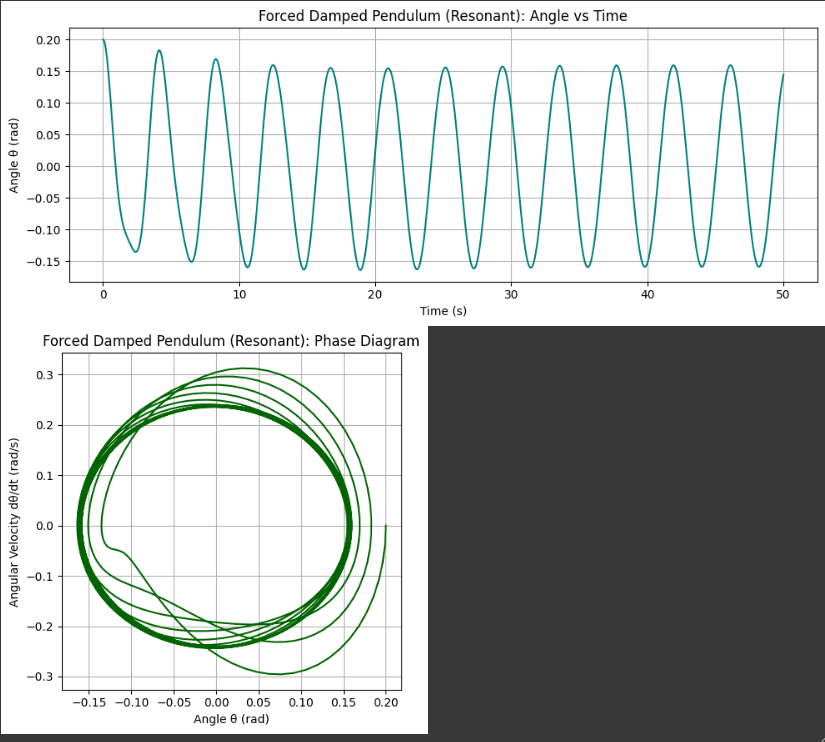
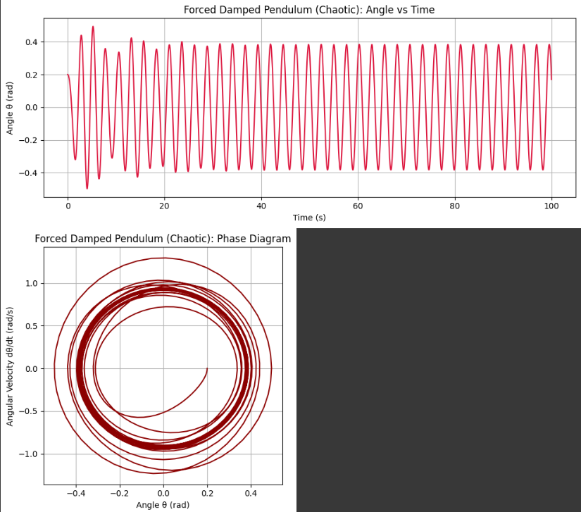

# Problem 2: Investigating the Dynamics of a Forced Damped Pendulum

## Motivation

The forced damped pendulum serves as a paradigmatic example in the study of nonlinear dynamics. Its rich behavior arises from the interplay of three key factors: restoring forces (gravity), damping (friction or air resistance), and an external periodic driving force.

Unlike the simple pendulum, which exhibits predictable periodic motion, the forced damped pendulum can transition into complex behaviors, including resonance, bifurcations, and chaos. These phenomena offer crucial insights into real-world systems such as mechanical oscillators, electrical circuits, climate models, and biological rhythms.

## 1. Theoretical Foundation

### Governing Equation

The motion is governed by the nonlinear differential equation:

$$\frac{d^{2}\theta}{dt^{2}} + b\frac{d\theta}{dt} + \frac{g}{L}\sin\theta = A\cos(\omega t)$$

Where:
- $\theta(t)$: angular displacement  
- $b$: damping coefficient  
- $g$: gravitational acceleration  
- $L$
$A$: amplitude of the external force  
- $\omega$: driving frequency

### Small-Angle Approximation

For small angles ($\theta \ll 1$):
$$\sin(\theta) \approx \theta$$

Reducing the equation to:

$$\frac{d^{2}\theta}{dt^{2}} + b\frac{d\theta}{dt} + \frac{g}{L}\theta = A\cos(\omega t)$$

### Resonance

- Natural frequency: $\omega_0 = \sqrt{\frac{g}{L}}$  
- Resonance occurs when $\omega \approx \omega_0$

## 2. Analysis of Dynamics

System behavior varies with:
- **Damping** $b$
- **Driving amplitude** $A$
$\omega$

### Motion Types
- Low amplitude / high damping → **Regular**
- Resonant driving → **Large oscillations**
- Intermediate values → **Quasiperiodic**
- Strong driving / low damping → **Chaotic**

## 3. Practical Applications

- Energy harvesting devices (piezoelectric pendulums)
- Suspension bridge and skyscraper stability
- Driven RLC circuits (electrical analog)
- Human biomechanics and rhythmic patterns

---

## 4. Numerical Implementation and Visualization

We solve the differential equation numerically and visualize time evolution and phase space trajectories under various conditions.

### Common Parameters:
- $g = 9.81$, $L = 1.0$
- Initial: $\theta(0) = 0.2$, $\dot{\theta}(0) = 0.0$
- Time: $t = 0$ to $50$

---

### **Case 1: Pure Pendulum**
- $b = 0$, $A = 0$

#### Plots:
- Angle vs Time  
- Phase Diagram

---

### **Case 2: Damped Pendulum**
- $b = 0.5$, $A = 0$

#### Plots:
- Angle vs Time  
- Phase Diagram

---

### **Case 3: Driven Pendulum**
- $b = 0$, $A = 1.2$, $\omega = 2.0$

#### Plots:
- Angle vs Time  
- Phase Diagram

---

### **Case 4: Forced Damped Pendulum – Resonant Motion**
- $b = 0.2$, $A = 1.2$, 4\omega = 1.5$

#### Plots:
- Angle vs Time  
- Phase Diagram

---

### **Case 5: Forced Damped Pendulum – Chaotic Motion**
- $b = 0.2$, $A = 1.5$, $\omega = 2.4$

#### Plots:
- Angle vs Time  
- Phase Diagram

---

## 5. Conclusion and Future Work

The forced damped pendulum illustrates transitions from regular to chaotic behavior through nonlinearity and sensitivity to parameters.

### Observations:
- Without damping/forcing: periodic motion
- Damping: energy loss
- Driving force: can induce resonance or chaos
- Full system: rich and complex dynamics

### Limitations
- 2D motion assumption  
- Linear damping  
- Sinusoidal forcing only

### Possible Extensions
- Nonlinear or velocity-dependent damping  
- Non-sinusoidal or stochastic forcing  
- Coupled/double pendulums  
- Lyapunov exponents and bifurcation analysis

---

