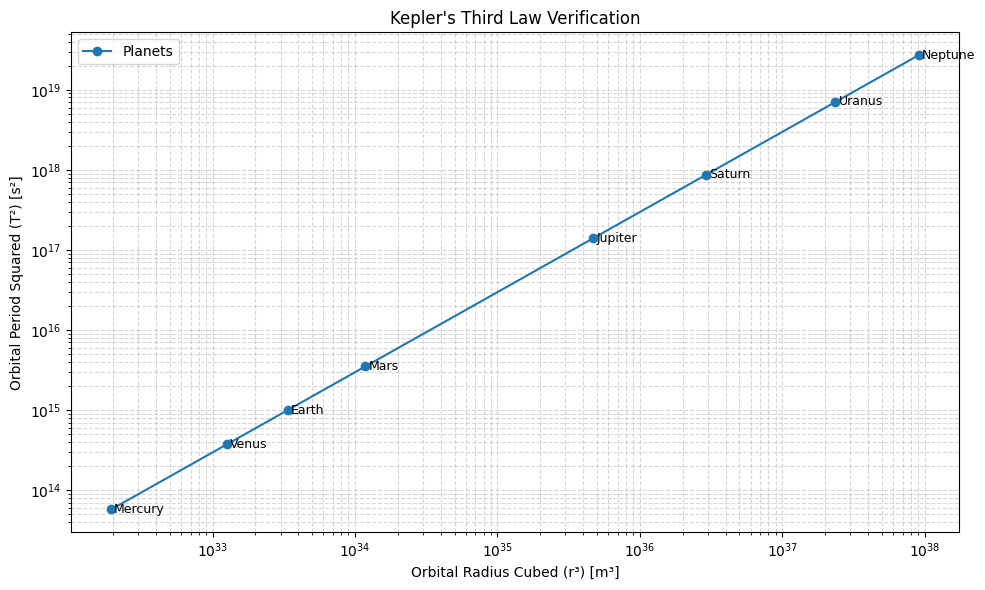
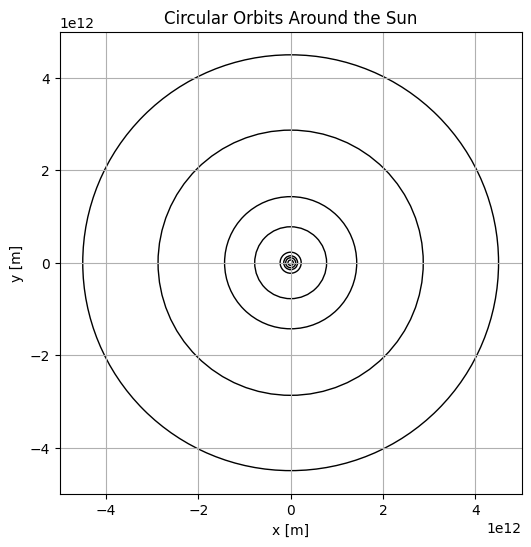

# Problem 1
#  Problem 1: Orbital Period and Orbital Radius

##  Derivation of Kepler's Third Law (Circular Orbits)

For a small body of mass  $m$ orbiting a much larger body of mass $M$, we assume a **circular orbit**.

### Newton's Law of Gravitation:

$F_g = \frac{G M m}{r^2}$

### Centripetal Force:

$F_c = \frac{m v^2}{r}$

Set \( F_g = F_c \):

$\frac{G M m}{r^2} = \frac{m v^2}{r}$

Cancel $m$, simplify:

$v^2 = \frac{G M}{r}$

Orbital period $T$ is:

$T = \frac{2\pi r}{v}$

Substitute $v$:

$T = \frac{2\pi r}{\sqrt{\frac{G M}{r}}} = 2\pi \sqrt{\frac{r^3}{G M}}$

### Final Form (Kepler’s Third Law):

$T^2 = \frac{4\pi^2}{G M} r^3$

---

##  Implications for Astronomy

1. **Mass Calculations**:
   
   $M = \frac{4\pi^2 r^3}{G T^2}$

2. **Planetary Distances**:
   Given $T$ and $M$, solve for $r$.

3. **Satellite Design**:
   Engineers use this to set satellite altitudes and periods (e.g., GPS, geostationary).

---

##  Real-World Example: Moon Around Earth

- $r = 3.84 \times 10^8 \, \text{m}$
- $T = 2.36 \times 10^6 \, \text{s}$

Use:

$M = \frac{4\pi^2 r^3}{G T^2}$

To compute Earth's mass.

---

[colab](https://colab.research.google.com/drive/1g2MB1rM0RoVmhZf8MjDkgUbHgoJWb3dO#scrollTo=Tj5SpZEEFrD_)

[Visualizing Circular Orbits](https://colab.research.google.com/drive/1bfOUd1E5QutzGK7wNj2TD0QKW8mN3dK1#scrollTo=knAj2HZ7IF-z)

##  Extension to Elliptical Orbits

Kepler’s Third Law holds for **elliptical orbits** as well, where the orbital radius $r$ is replaced by the **semi-major axis** $a$:

$T^2 \propto a^3$

This means the square of the orbital period is proportional to the cube of the semi-major axis, even if the orbit is not a perfect circle.

### This applies to:

- **Elliptical planetary orbits** (e.g., Mars, which has a noticeable eccentricity)
-  **Binary star systems**, where two stars orbit their common center of mass
-  **Asteroids and comets**, which often have highly eccentric elliptical orbits

The generalized form of Kepler’s Third Law becomes:

$\frac{T^2}{a^3} = \frac{4\pi^2}{G(M_1 + M_2)}$

Where:
- $T$ = orbital period
- $a$ = semi-major axis of the orbit
- $M_1$, $M_2$ = masses of the two orbiting bodies
