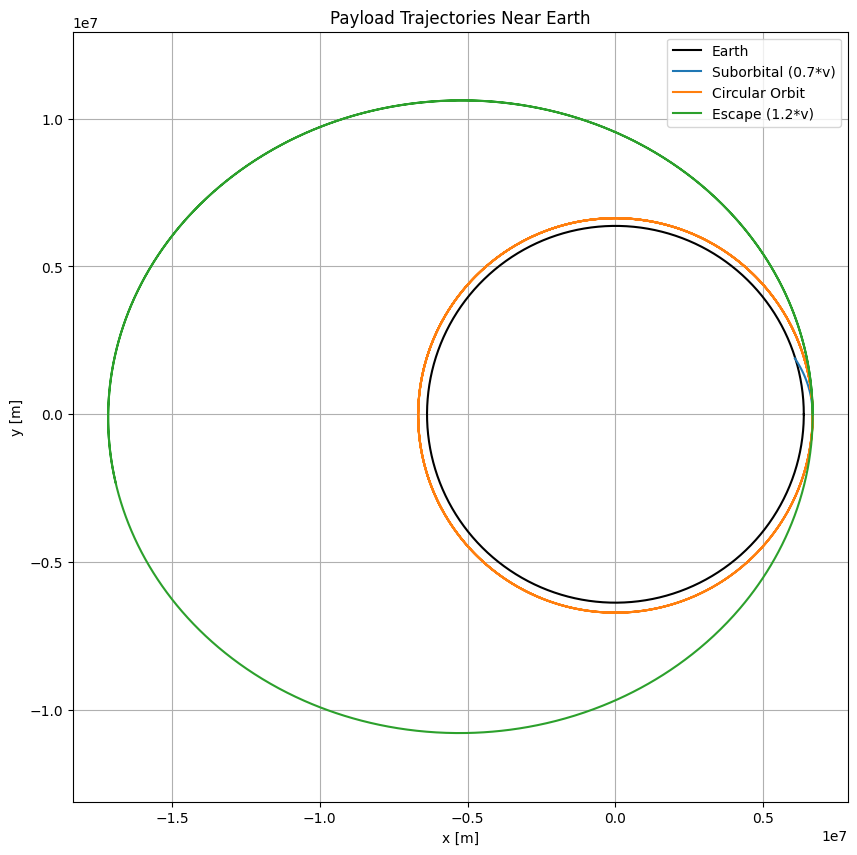
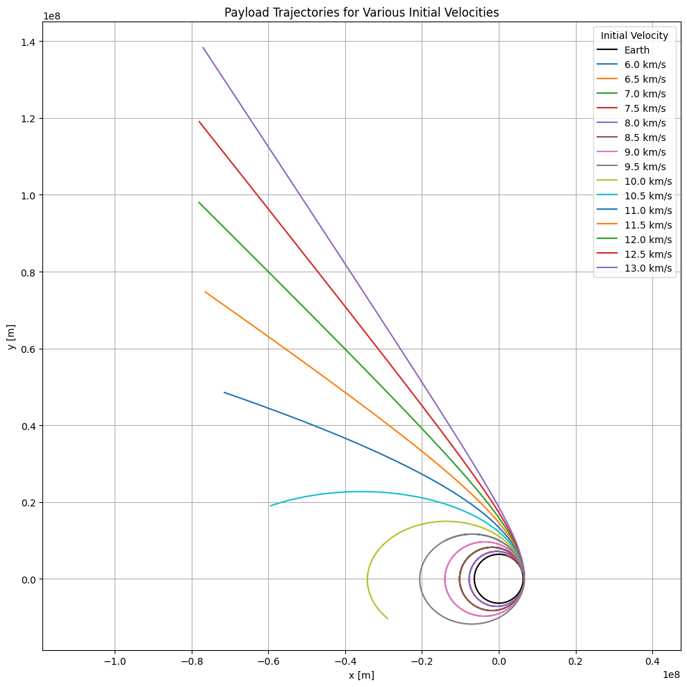

# Problem 3
# **Trajectories of a Freely Released Payload Near Earth**

## **1. Introduction and Motivation**

In the realm of spaceflight and orbital mechanics, understanding how objects behave when released from a spacecraft near Earth is critical. A payload released from a moving rocket can follow drastically different paths depending on its velocity, altitude, and direction at the moment of release.

This analysis is relevant to a variety of space missions:
- **Satellite deployment** in low Earth orbit (LEO), medium Earth orbit (MEO), or geostationary orbit (GEO)
- **Reentry missions**, such as returning crew capsules or probes to Earth
- **Interplanetary missions**, where the spacecraft must escape Earth’s gravity entirely

The trajectory of the released payload can be parabolic, elliptical, circular, or hyperbolic. Which path it takes is governed by Newtonian gravity and orbital dynamics. These scenarios demonstrate the elegance and complexity of celestial mechanics and offer an excellent opportunity to apply numerical methods.

---

## **2. Theoretical Background**

### **2.1 Newton's Law of Universal Gravitation**

Newton's law describes the force between two masses:

$\vec{F} = -\frac{G M m}{r^2} \hat{r}$

Where:
- $\vec{F}$: gravitational force vector  
- $G$: gravitational constant $6.674 \times 10^{-11} \, \text{Nm}^2/\text{kg}^2$  
- $M$: mass of Earth $5.972 \times 10^{24}$ kg  
- $m$: mass of payload  
- $r$: distance from the center of the Earth  
- $\hat{r}$: unit vector pointing from the payload to the center of the Earth  

The resulting acceleration on the payload is:

$\vec{a} = -\frac{GM}{r^2} \hat{r}$

---

### **2.2 Types of Trajectories**

Orbital paths are conic sections, depending on the payload's total specific mechanical energy $(E)$:

$E = \frac{v^2}{2} - \frac{GM}{r}$

- **Circular Orbit** $E < 0$, constant $r$: payload moves at constant altitude and speed.
- **Elliptical Orbit** $E < 0$: closed loop, apogee and perigee define min/max altitudes.
- **Parabolic Escape** $E = 0$: minimum speed needed to escape Earth's gravity.
- **Hyperbolic Trajectory** $E > 0$: payload escapes Earth with excess velocity.

---

## **3. Numerical Method and Simulation**
[colab](https://colab.research.google.com/drive/1raWB9TNWxT8IPwkEpjn4Eet5dzij_V4j#scrollTo=ODDZ1N6_kte4)

## **4. Results and Interpretation**

### **4.1 Suborbital Trajectory**

- Initial speed: ~70% of circular orbital speed  
- Result: Payload arcs and returns to Earth (ballistic path)  
- Applications: Missile paths, failed orbital insertions

### **4.2 Circular Orbit**

- Initial speed: Just right to balance gravity and inertia  
- Result: Stable circular motion around Earth  
- Applications: Satellites, ISS

### **4.3 Escape Trajectory**

- Initial speed: Greater than escape velocity  
- Result: Payload continues outward forever (ignoring other celestial bodies)  
- Applications: Deep space probes (Voyager, Pioneer, etc.)

---

## **5. Key Concepts and Calculations**

### **5.1 Escape Velocity**

Escape velocity from a given altitude $h$:

$v_{esc} = \sqrt{2GM/(R + h)}$

From 300 km above Earth:  

$v_{esc} \approx 11.2 \text{ km/s}$

### **5.2 Orbital Energy**

Total mechanical energy per unit mass:

$E = \frac{v^2}{2} - \frac{GM}{r}$

-$E < 0$: Bound (elliptical or circular)  
- $E = 0$: Parabolic escape  
- $E > 0$: Hyperbolic escape

---

## **6. Extensions and Further Work**

- **Vary direction** of initial velocity to explore inclined orbits  
- Add **atmospheric drag** for low-altitude reentry modeling  
- Incorporate **multi-body gravity** (e.g., Moon’s effect)  
- Use **Runge-Kutta 4th order** for better accuracy  
- Allow **interactive sliders** for real-time simulation tuning  

---

## **7. Real-World Applications**

- **Satellite Constellations** (Starlink, GPS): Require precise orbital insertions.  
- **Earth Observation Missions**: Often use elliptical Sun-synchronous orbits.  
- **Planetary Missions**: Must achieve hyperbolic escape from Earth to begin transfer orbits.  
- **Reentry Planning**: Capsules must target precise entry points to land safely.  

---

## **8. Conclusion**

The motion of a payload released near Earth is governed by gravitational physics and initial conditions. By simulating different launch velocities, we can observe distinct types of orbits and transitions. Such analysis is foundational for planning and executing space missions, ensuring payloads reach their intended destinations — be it orbit, Earth, or deep space.

Understanding these trajectories equips us with the tools to navigate space with precision and safety.
