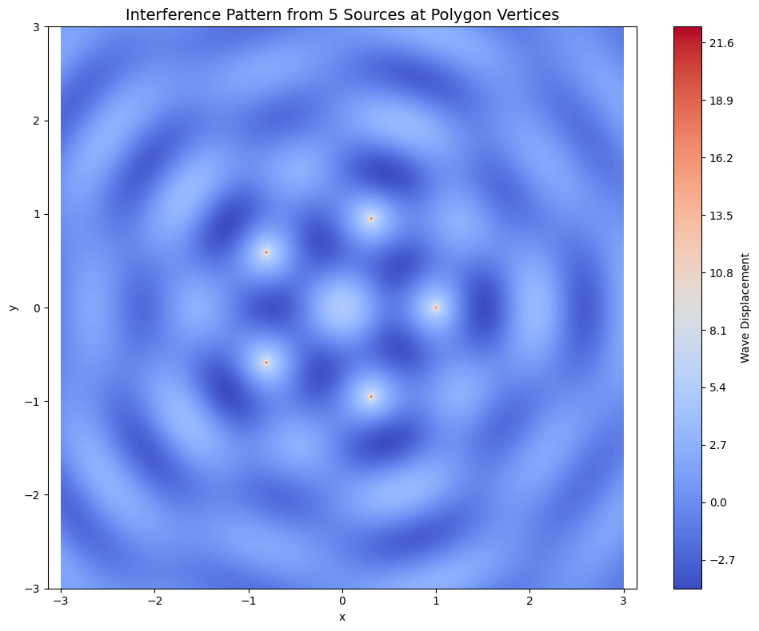

# Problem 1
 
 #  Interference Patterns on a Water Surface

##  Introduction

Wave phenomena are among the most fundamental and visually captivating aspects of physics. They appear in many forms, from ripples on a pond to sound waves in the air, electromagnetic waves in space, and even probability waves in quantum mechanics. One of the most fascinating and important behaviors of waves is **interference**—the phenomenon where two or more waves overlap and combine to form a new wave pattern.

This report explores wave interference patterns on a water surface using a computational approach. By simulating point sources arranged at the vertices of a regular polygon, we analyze the resulting wave superposition to visualize and interpret the interference phenomena. The goal is to understand how symmetry, wave coherence, and spatial arrangement affect the resultant wave field.

---

##  Motivation

Understanding interference not only helps in grasping fundamental wave behavior but also provides insight into real-world technologies and natural systems. Interference plays a key role in:

- **Optics**: Diffraction gratings, anti-reflective coatings, holography.
- **Acoustics**: Sound engineering, noise-cancellation technologies.
- **Quantum Physics**: Double-slit experiments, quantum interference.
- **Water Engineering**: Harbor design, wave energy devices.

Observing wave interactions on a water surface gives an intuitive visualization of how multiple sources influence each other. The task provides an educational and computational framework for studying **constructive interference** (amplification) and **destructive interference** (cancellation).

---

##  Theoretical Framework

### A. Circular Wave Equation

The disturbance created by a single point source on a 2D water surface can be described by a circular wave function:

$\eta(x, y, t) = \frac{A}{\sqrt{r}} \cos(kr - \omega t + \phi)$

Where:

- $\eta(x, y, t)$: Water surface displacement at position $(x, y)$ and time $t$
- $A$: Amplitude of the wave
- $r = \sqrt{(x - x_0)^2 + (y - y_0)^2}$: Radial distance from the source at $(x_0, y_0)$
- $k = \frac{2\pi}{\lambda}$: Wave number, related to the wavelength $\lambda$
- $\omega = 2\pi f$: Angular frequency, with $f$ being the frequency
- $\phi$: Phase shift (set to zero in our simulation for coherence)

### B. Superposition Principle

When multiple such waves overlap, their effects **add linearly** at each point due to the principle of superposition:

$\eta_{\text{sum}}(x, y, t) = \sum_{i=1}^{N} \eta_i(x, y, t)$

Where $N$ is the number of sources. Each \(\eta_i\) is calculated using the same wave function but from a different origin.

---

##  Experimental Design

### Step 1: Select a Polygon

To study the effects of symmetry, a **regular polygon** is chosen. Examples include:

- Triangle (3 sides)
- Square (4 sides)
- Pentagon (5 sides)
- Hexagon (6 sides)
- Octagon (8 sides)

For this analysis, we selected a **regular pentagon**, which introduces rich symmetry and complexity in interference patterns.

### Step 2: Place the Sources

Each wave source is placed at a vertex of the polygon. The coordinates of the vertices on the unit circle are calculated as:

$(x_i, y_i) = \left(R \cos\left(\frac{2\pi i}{N}\right), R \sin\left(\frac{2\pi i}{N}\right)\right), \quad i = 0, 1, ..., N-1$

Where $R$ is the radius of the circle (typically set to 1).

### Step 3: Compute the Wave Field

A grid is defined in the $(x, y)$ space. For each point, we compute its distance from each source and apply the wave function. The total displacement is obtained by summing up the contributions from all sources.

### Step 4: Analyze the Interference

Interference occurs where the wave crests and troughs of different sources overlap:

- **Constructive Interference**: Waves in phase → larger amplitude
- **Destructive Interference**: Waves out of phase → cancellation

The resulting pattern is visualized using contour plots.

---

[colab](https://colab.research.google.com/drive/1Rt-6yHZVJXXU7QQi_MIY_-0LrP8VFZ9B?usp=sharing)