# Problem 1
# Simulating the Effects of the Lorentz Force

---

## 1. Introduction and Motivation

The Lorentz force is a cornerstone concept in electromagnetism and plasma physics, describing how charged particles behave under the influence of electric and magnetic fields. The force is defined by the equation:

$\mathbf{F} = q(\mathbf{E} + \mathbf{v} \times \mathbf{B})$

where $q$ is the charge of the particle, $\mathbf{E}$ is the electric field, $\mathbf{v}$ is the particle’s velocity, and $\mathbf{B}$ is the magnetic field.

This force governs the motion of charged particles in a vast array of physical systems ranging from tiny electrons in semiconductors to charged particles in astrophysical plasmas. Understanding the particle trajectories under the Lorentz force is essential for the design and operation of technologies such as particle accelerators, plasma confinement devices, and mass spectrometers. Furthermore, studying these trajectories provides fundamental insights into space physics, fusion energy research, and radiation belts surrounding planets.

---

## 2. Exploration of Applications

### 2.1 Particle Accelerators

In particle accelerators, charged particles such as electrons, protons, or ions are propelled to high speeds using electric fields and steered or confined using magnetic fields. The Lorentz force is used to precisely control the trajectory of particles, ensuring they follow desired paths within accelerator components like cyclotrons, synchrotrons, or linear accelerators. Magnetic fields bend particle beams, while oscillating electric fields accelerate them.
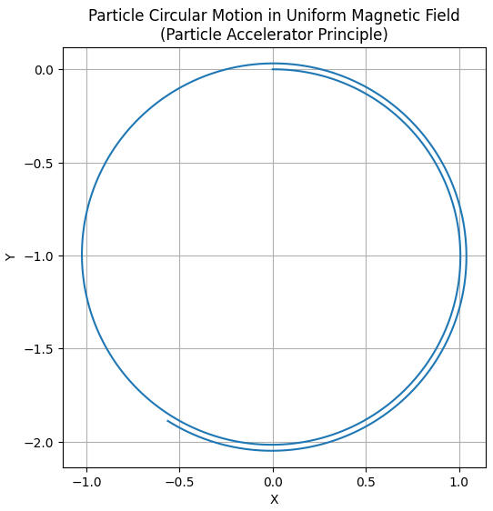

### 2.2 Mass Spectrometers

Mass spectrometers exploit the Lorentz force to differentiate ions based on their mass-to-charge ratio. When ions enter a magnetic field region, their trajectories curve according to their charge and velocity. Measuring this curvature allows determination of molecular weights and identification of substances. This technology is widely used in chemistry, biology, and environmental science.

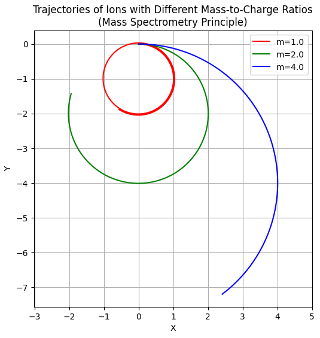

### 2.3 Plasma Confinement

Magnetic confinement fusion devices, such as tokamaks and stellarators, rely on strong magnetic fields to confine hot, charged plasma particles. The Lorentz force causes particles to gyrate around magnetic field lines, creating confinement. Understanding particle orbits and drifts in complex magnetic geometries is crucial to minimizing plasma losses and maintaining stable fusion conditions.

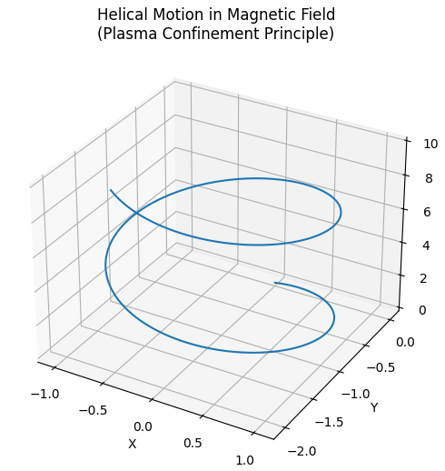

### 2.4 Astrophysical Contexts

In space and astrophysics, charged particles like cosmic rays and solar wind ions interact with planetary and interstellar magnetic fields. Their motion influenced by the Lorentz force results in phenomena such as auroras, radiation belts, and magnetic reconnection events. Modeling these effects aids in understanding space weather and protecting satellites.

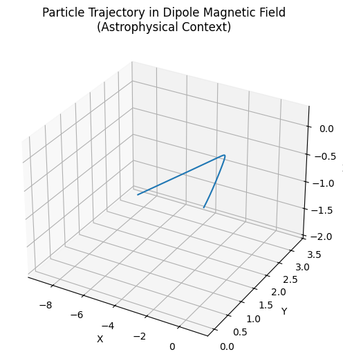

---

## 3. Role of Electric and Magnetic Fields

### 3.1 Electric Field Effects

The electric field applies a force in the direction of the field on charged particles. This accelerates or decelerates the particles, increasing or decreasing their kinetic energy. In a uniform electric field, a charged particle experiences linear acceleration.

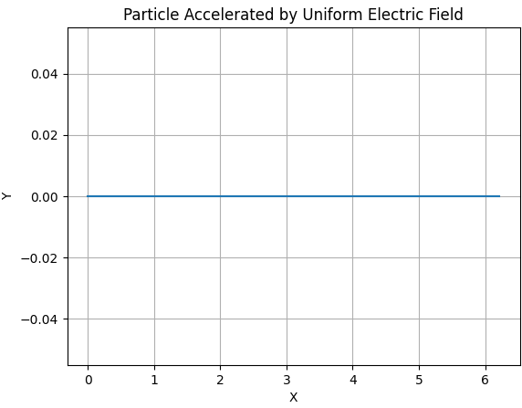

### 3.2 Magnetic Field Effects

A magnetic field exerts a force perpendicular to both the particle’s velocity and the magnetic field vector. This force does no work on the particle (it does not change kinetic energy) but alters the direction of motion, causing circular or helical trajectories depending on the initial velocity components relative to the field.

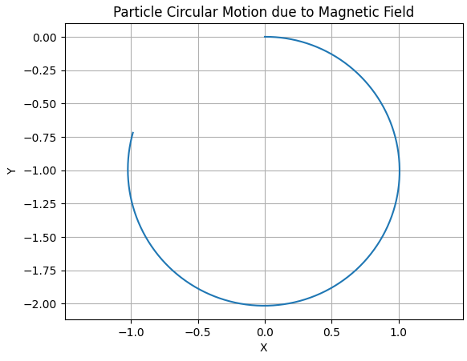

### 3.3 Combined Electric and Magnetic Fields

When electric and magnetic fields coexist, particle motion becomes more complex. The particle experiences acceleration along the electric field and a perpendicular magnetic force, resulting in helical trajectories, drifts, or oscillations. Special cases such as crossed fields (perpendicular electric and magnetic fields) lead to well-known drift velocities.

---

## 4. Simulating Particle Motion Under the Lorentz Force

The particle’s motion can be described by Newton’s second law:

$m \frac{d\mathbf{v}}{dt} = q(\mathbf{E} + \mathbf{v} \times \mathbf{B})$

This is a coupled system of differential equations for the particle’s velocity and position:

$\frac{d\mathbf{r}}{dt} = \mathbf{v}$

To study the trajectories, one needs to solve these equations numerically, as analytical solutions exist only for simple cases.

### 4.1 Numerical Integration Methods

The equations can be integrated using time-stepping methods:

- **Euler method:** Simple but less accurate; updates position and velocity using current derivatives.
- **Runge-Kutta methods:** Higher order methods, such as RK4, balance computational cost and accuracy, widely used in physics simulations.
- **Leapfrog or Boris algorithm:** Specifically adapted for charged particle motion under electromagnetic fields, preserving energy better over long simulations.

---

## 5. Characteristic Particle Motions

### 5.1 Circular Motion in Uniform Magnetic Field

If the particle’s velocity is perpendicular to a uniform magnetic field and no electric field is present, it undergoes circular motion at constant speed. The radius of the circle is known as the **Larmor radius** or **gyroradius**:

$r_L = \frac{m v_{\perp}}{|q| B}$

where $v_{\perp}$ is the velocity component perpendicular to $\mathbf{B}$.

The particle revolves around the magnetic field lines with an angular frequency called the **cyclotron frequency**:

$\omega_c = \frac{|q| B}{m}$

### 5.2 Helical Motion with Velocity Components Along $\mathbf{B}$

If the particle’s velocity has a component parallel to $\mathbf{B}$, the motion becomes helical — a combination of circular gyration and linear motion along the field lines.

### 5.3 Drift Motion in Crossed Electric and Magnetic Fields

When $\mathbf{E}$ and $\mathbf{B}$ fields are perpendicular, particles experience a drift velocity given by:

$\mathbf{v}_d = \frac{\mathbf{E} \times \mathbf{B}}{B^2}$

This drift is independent of the charge and mass of the particle and results in a steady sideways motion of the guiding center of the particle's orbit.

---

## 6. Parameter Exploration

### 6.1 Varying Field Strengths

Increasing magnetic field strength $B$ reduces the Larmor radius and increases cyclotron frequency, resulting in tighter and faster gyration. Increasing electric field strength $E$ accelerates particles more strongly and influences the drift speed.

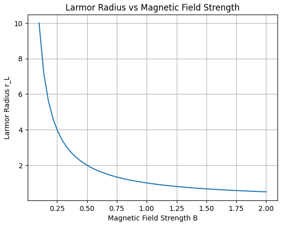

### 6.2 Varying Initial Velocity

Particles with higher initial perpendicular velocity have larger gyroradii, whereas particles with significant parallel velocity components move faster along the magnetic field lines.
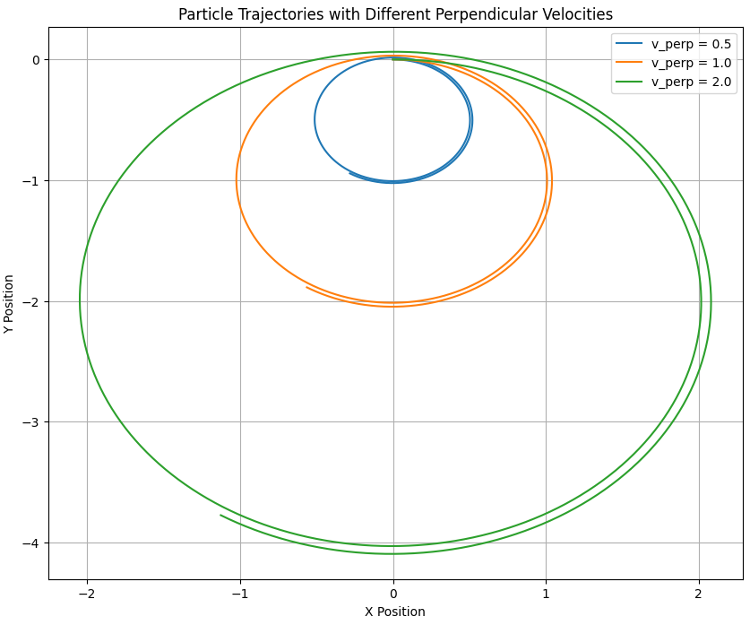

### 6.3 Varying Charge and Mass

Electrons, with small mass and negative charge, have very small radii and high frequencies compared to heavier ions with positive charges. Charge sign determines the direction of gyration.
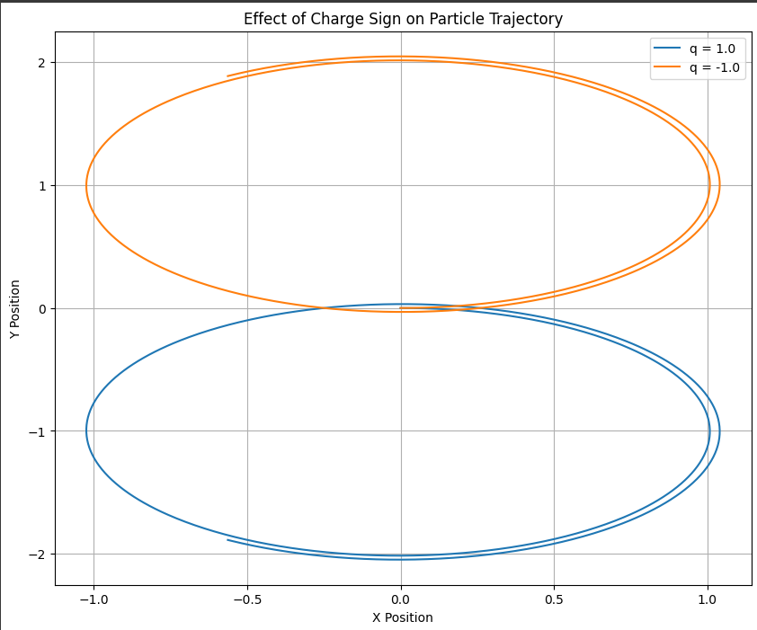

---

## 7. Visualization of Particle Trajectories

To understand the motion, trajectories can be plotted:

- **2D plots:** Useful for visualizing circular or drift paths in a plane.
- **3D plots:** Show full spatial paths, especially for helical motion.
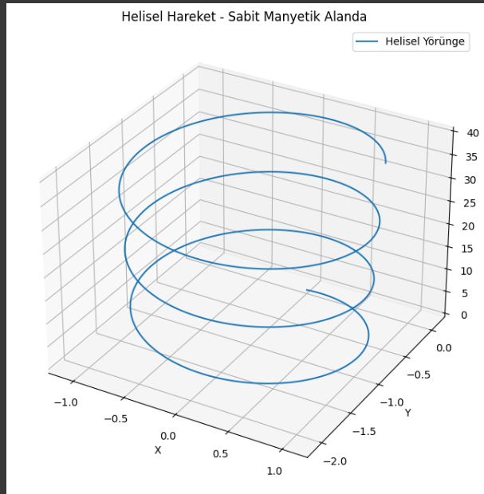

Important phenomena like Larmor radius and drift velocity can be visually identified.
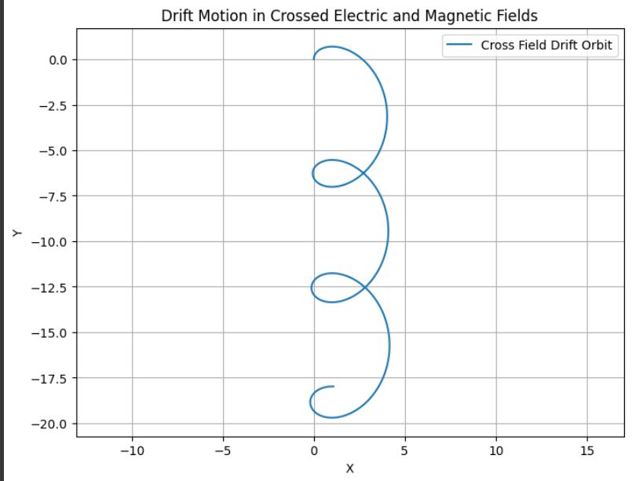

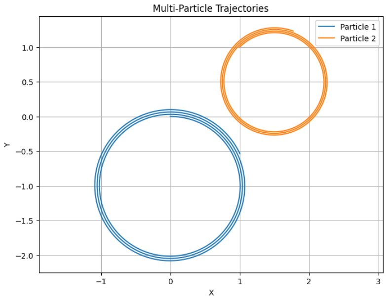
---

## 8. Practical Relevance and Relation to Real Systems

### 8.1 Cyclotrons

Cyclotrons use perpendicular magnetic fields to bend particles in circular orbits, combined with electric fields to accelerate them. The balance between cyclotron frequency and acceleration timing is crucial, a fact clearly reflected in simulation results of circular motion.
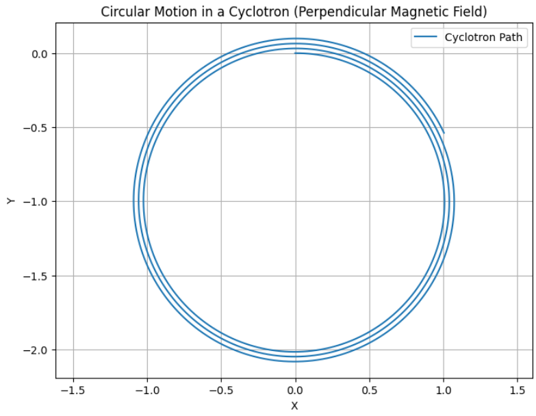

### 8.2 Magnetic Confinement Fusion Devices

In devices like tokamaks, strong toroidal and poloidal magnetic fields trap plasma particles. Simulations help understand how charged particles move, escape, or drift, providing insights into plasma stability.

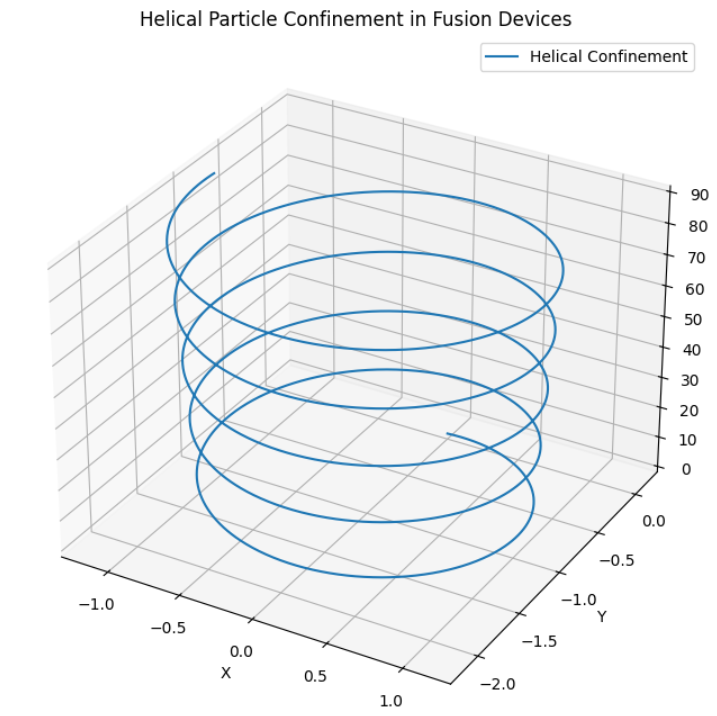

### 8.3 Mass Spectrometry

Simulation of particle trajectories under magnetic fields replicates how ions of different mass-to-charge ratios separate spatially. This principle underlies mass spectrometer design.

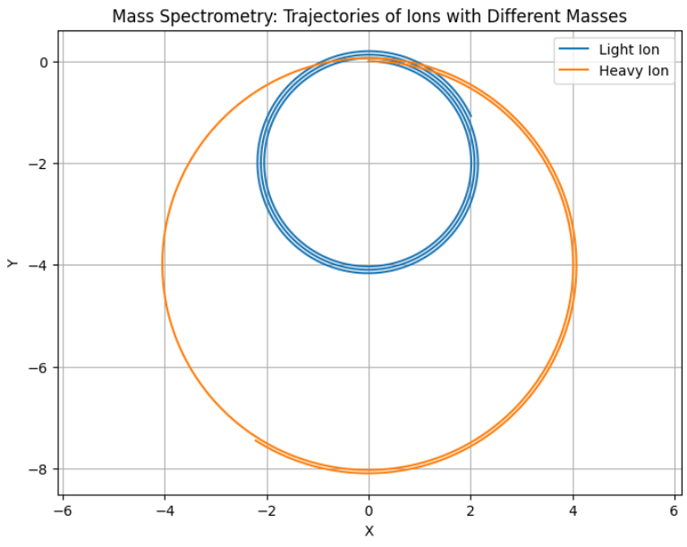
---

## 9. Suggestions for Extending the Simulation

### 9.1 Non-uniform Fields

Including magnetic field gradients, such as magnetic mirrors or dipole fields, introduces additional forces and changes particle confinement characteristics.
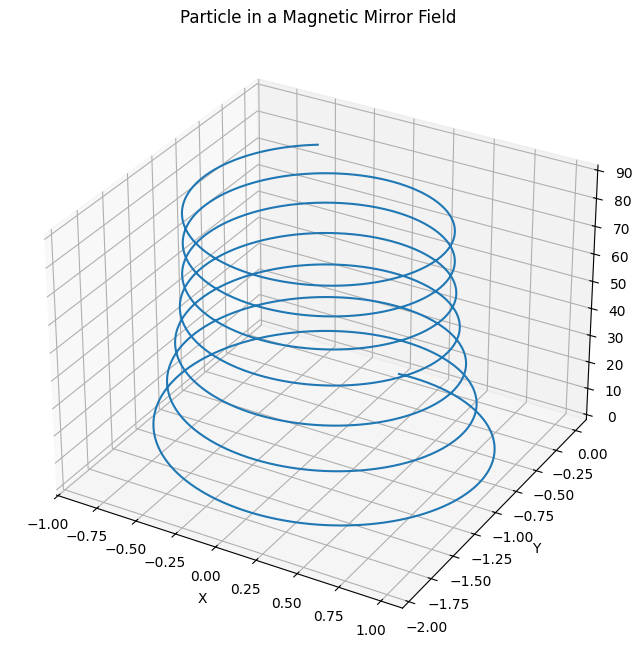

### 9.2 Relativistic Particles

For particles approaching the speed of light, relativistic effects alter mass and momentum, requiring modified equations of motion.

### 9.3 Particle Interactions

Including collisions or collective effects models plasma behavior more realistically.

### 9.4 Multiple Particles and Statistical Analysis

Simulating many particles can reveal collective phenomena like diffusion and transport.

### 9.5 Improved Numerical Techniques

Algorithms specialized for charged particle motion, such as the Boris method, improve energy conservation and long-term stability.

---

## 10. Conclusion

Simulating the motion of charged particles under the Lorentz force provides deep insights into fundamental physical processes and practical applications. By exploring different electromagnetic field configurations and particle parameters, we can reproduce and understand a wide range of phenomena, from simple circular orbits to complex drift motions.

These simulations bridge theory and real-world systems like cyclotrons, magnetic traps, and space plasmas, enhancing our ability to design technologies and interpret observations in plasma physics, accelerator physics, and astrophysics.

---

[colab simulation](https://colab.research.google.com/drive/1fKVNDigijtCxfYzVecVJrw-pPz9ws2jH?usp=sharing)