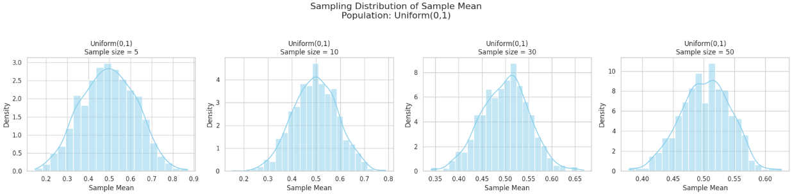

# Problem 1

# Exploring the Central Limit Theorem through Simulations

## Introduction

The Central Limit Theorem (CLT) is a fundamental principle in statistics which states that, given a sufficiently large sample size, the distribution of the sample means will approximate a normal distribution regardless of the shape of the population distribution. This project uses simulations to illustrate this phenomenon with different population distributions and sample sizes.

---

## ## 1. Simulating Sampling Distributions

To investigate and visualize the Central Limit Theorem (CLT), we begin by simulating datasets from several different population distributions. The goal is to observe how the distribution of sample means behaves depending on the characteristics of the population and how it evolves as we increase the sample size.

In this study, we consider three distinct types of population distributions, each with different shapes and properties:

- **Uniform distribution:** This is a continuous probability distribution where all outcomes are equally likely within a specific range (e.g., between 0 and 1). It has a flat, rectangular shape and is symmetric. It provides a simple baseline to observe how quickly the sample mean distribution converges to normality, especially since it lacks skewness.

- **Exponential distribution:** This is a continuous, positively skewed distribution commonly used to model waiting times between independent events. It has a high variance and long tail. Because of its skewness, the exponential distribution allows us to test the robustness of the CLT under non-symmetric conditions and see how large a sample size is needed before the sampling distribution of the mean begins to resemble a normal distribution.

- **Binomial distribution:** This is a discrete distribution representing the number of successes in a fixed number of independent Bernoulli trials (e.g., flipping a coin multiple times). Depending on its parameters (such as \(n=10\), \(p=0.5\)), it can be symmetric or skewed. It is useful for examining how the CLT applies to discrete and bounded populations.

For each of these distributions, we generate a large dataset (representing the full population), typically consisting of 100,000 or more data points. These synthetic populations serve as the foundation from which we will draw repeated random samples.

By simulating data from a variety of population types—continuous vs. discrete, symmetric vs. skewed—we can assess the generality of the CLT and explore how the shape and spread of the original distribution affect the behavior of the sample means. This step lays the groundwork for understanding how statistical inference is possible even when the underlying data are not normally distributed.

---

## 2. Sampling and Visualization

We randomly sample from each population with sample sizes of 5, 10, 30, and 50. For each sample size, we repeat sampling 1000 times, calculate the sample mean, and visualize the sampling distribution of the sample mean.

---

## 3. Parameter Exploration

We observe how the original population distribution shape and sample size influence the convergence rate to a normal distribution and how population variance affects the spread of the sampling distribution.

---

## 4. Practical Applications

The Central Limit Theorem is critical in various real-world applications:

- **Estimating population parameters:** The CLT enables us to use sample statistics to infer population values.
- **Quality control in manufacturing:** Understanding the distribution of sample means helps in setting control limits and maintaining product consistency.
- **Financial modeling:** Aggregated returns often approach a normal distribution, justifying the use of probabilistic models in finance.

[Colab](https://colab.research.google.com/drive/12Z-9wAoqlMDmrrKYHYNShal0FZZwQvDG?usp=sharing)

---

## Results

The simulation will generate histograms of sample means from different distributions and sample sizes. These visualizations help us observe the transition of the sampling distribution towards normality as sample size increases.

---

## Discussion

### Observations:

- **Uniform Distribution:** Symmetric and approaches normal distribution quickly as sample size increases.
- **Exponential Distribution:** Skewed population leads to skewed sample mean distributions at low sample sizes, but these become more symmetric with larger samples.
- **Binomial Distribution:** Discrete but symmetric; sampling distribution approaches normality even with moderate sample sizes.

### Effect of Sample Size and Variance

- As **sample size increases**, the variability (i.e., standard deviation) of the sample mean **decreases**. This is a direct consequence of the formula for the standard error of the mean:

  
  $\text{Standard Error} = \frac{\sigma}{\sqrt{n}}$

  where $\sigma$ is the population standard deviation and $n$ is the sample size. This relationship shows that with larger sample sizes, the sample means cluster more tightly around the population mean, resulting in a narrower sampling distribution.

- **Distributions with higher population variance** lead to greater spread in the sample means, particularly when the sample size is small. For example, an exponential distribution, which is both skewed and has high variance, will produce wider and more irregular sampling distributions of the mean at lower sample sizes. Despite this, as the sample size increases, the Central Limit Theorem (CLT) ensures that the distribution of the sample mean still approaches a normal distribution.

- When comparing different population distributions, the effect becomes even clearer. A **binomial distribution** (especially with parameters that produce a symmetric shape) quickly yields a nearly normal sampling distribution even at moderate sample sizes. In contrast, the **exponential distribution**, being heavily skewed, requires larger samples (e.g., $n \geq 30 $) before its sample means resemble a normal distribution.

- It's also important to emphasize that while **sample size** controls the spread and smoothness of the sampling distribution, the **shape of the original population** affects the *rate* at which convergence to normality happens. Populations with more extreme skewness or kurtosis converge more slowly and require larger samples.

- Overall, these findings demonstrate the robustness and universality of the CLT. Regardless of the original population's variance or distribution shape, the sampling distribution of the mean becomes approximately normal as sample size grows, and its variability decreases predictably with the square root of the sample size.

## Conclusion

This study demonstrates the Central Limit Theorem in practice. Regardless of the original population distribution, the distribution of sample means becomes approximately normal as the sample size grows. This property forms the basis for many inferential techniques in statistics.

---

