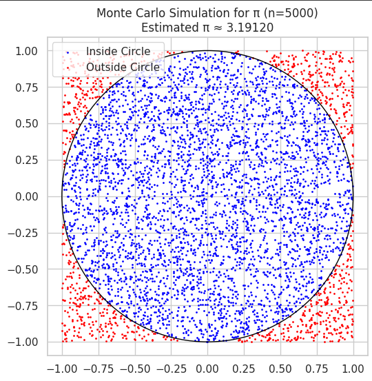
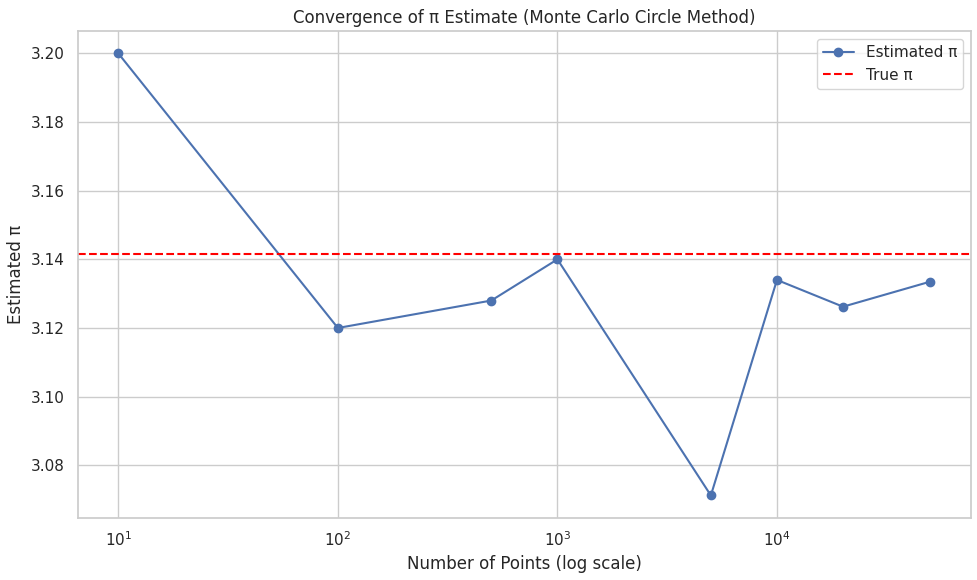
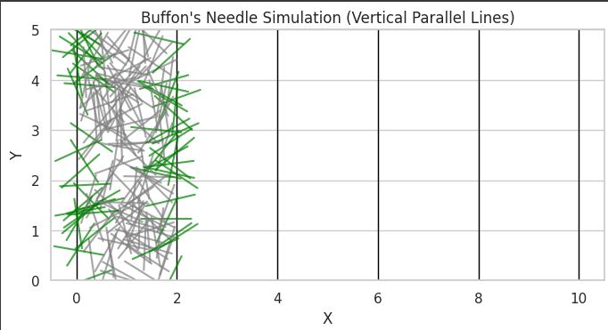

# Problem 2
# Estimating π Using Monte Carlo Methods

## Motivation

Monte Carlo methods are a class of computational algorithms that rely on repeated random sampling to obtain numerical results. These methods are widely used in physical sciences, finance, engineering, and computer science due to their flexibility and simplicity.

One of the most elegant and visually intuitive applications of Monte Carlo methods is estimating the value of π. This problem allows us to explore the concepts of probability, geometry, and numerical simulation in an engaging way.

In this project, we will implement and compare two classic Monte Carlo methods for estimating π:

1. **Using Geometric Probability with a Circle**
2. **Using the Probabilistic Approach of Buffon's Needle**

Each method uses randomness in a different way, and their comparison provides insight into convergence behavior, computational efficiency, and statistical variability.

---

## Part 1: Estimating π Using a Circle

### 1. Theoretical Foundation

Consider a unit circle (radius = 1) inscribed in a square with side length 2 (from -1 to 1 in both x and y directions). The area of the circle is $A_{\text{circle}} = \pi r^2 = \pi$, and the area of the square is $A_{\text{square}} = 4$.

If we randomly generate points within the square, the proportion of points that fall inside the circle should approximate the ratio of the areas:

$\frac{\text{Points inside the circle}}{\text{Total points}} \approx \frac{\pi}{4}$

Therefore, multiplying both sides by 4 gives us an estimate for π:

$π ≈ 4 \cdot \frac{\text{Points inside the circle}}{\text{Total points}}$

This approach leverages the **Law of Large Numbers**, which states that the average of results from a large number of trials should be close to the expected value.

### 2. Simulation Procedure

- Generate $n$ random (x, y) points uniformly distributed within the square $[-1, 1] \times [-1, 1]$.
- For each point, check whether it lies inside the unit circle using the condition $x^2 + y^2 \leq 1$.
- Count the number of points that fall inside the circle.
- Estimate π using the formula above.

### 3. Visualization

- Create a scatter plot:
  - **Blue points** represent those that fall inside the circle.
  - **Red points** represent those that fall outside.
- Optionally, draw the outline of the circle for reference.

### 4. Analysis and Discussion

- Analyze the accuracy of the π estimate as a function of the number of points.
- Plot a graph showing how the estimate converges to the true value of π as \( n \) increases.
- Evaluate how many points are needed to achieve 2 or 3 decimal places of accuracy.
- Discuss:
  - Variance of the estimate.
  - Trade-offs between computational cost and precision.
  - Strengths and limitations of this approach.

  

---

## Part 2: Estimating π Using Buffon's Needle

### 1. Theoretical Foundation

Buffon's Needle is a classical problem in geometric probability, proposed in the 18th century. It involves dropping a needle of length \( L \) onto a plane ruled with parallel lines spaced a distance \( D \) apart.

The probability \( P \) that the needle crosses a line is given by:

$P = \frac{2L}{πD}$

Rearranging this gives a formula to estimate π:

$π ≈ \frac{2L \cdot n}{D \cdot c}$

Where:
- $n$ is the number of needle drops,
- $c$ is the number of times the needle crosses a line.

Assuming $L \leq D$ simplifies the problem and ensures correctness of the formula.

### 2. Simulation Procedure

- Set values for $L$ and $D$ such that $L \leq D e.g., $\L = 1 $, $D = 2 $.
- For each needle drop:
  - Randomly generate a center point of the needle along the y-axis.
  - Randomly generate an angle $θ$ between 0 and π.
  - Determine the positions of the needle’s two ends.
  - Check whether the needle crosses a line.
- Count total drops and total crossings.
- Estimate π using the derived formula.

### 3. Visualization

- Create a diagram showing the positions of dropped needles.
  - **Crossing needles** can be shown in one color (e.g., green).
  - **Non-crossing needles** can be shown in another (e.g., gray).
- Overlay the parallel lines to clearly visualize the setup.

### 4. Analysis and Discussion

- Investigate the convergence of the π estimate with increasing number of trials.
- Plot π estimates versus number of drops.
- Compare statistical noise and variance with the circle-based method.
- Discuss practical difficulties:
  - Lower probability of crossing results in slower convergence.
  - Higher variance, especially for small numbers of drops.
  - Computational complexity of checking line intersections.

---

## Comparison of the Two Methods

| Criteria                    | Circle-Based Method            | Buffon’s Needle Method           |
|----------------------------|--------------------------------|----------------------------------|
| **Conceptual Simplicity**  | Simple geometric check         | Involves trigonometry            |
| **Convergence Speed**      | Faster                         | Slower (high variance)           |
| **Code Complexity**        | Low                            | Moderate                         |
| **Accuracy per Trial**     | Generally higher               | Lower due to randomness in angles|
| **Visual Appeal**          | High (clean points in/out)     | Medium (depends on needle layout)|
| **Historical Significance**| Modern method                  | Classical, dating to 1700s        |

---

## Conclusion

Both Monte Carlo methods effectively demonstrate how randomness can be used to estimate a fundamental constant like π. While the circle-based method tends to be more efficient and accurate with fewer samples, Buffon's Needle offers a fascinating historical and theoretical perspective. By analyzing convergence, computational cost, and visualization, we gain a deeper understanding of the strengths and trade-offs of probabilistic simulations.

---

